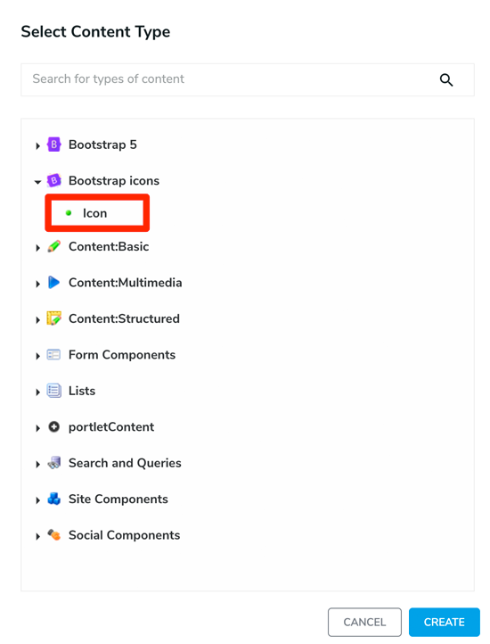

# Bootstrap Icons

> This is a Jahia 8 implementation of the free, high-quality, open-source icon library with over 1,800 icons. Icons can be embed, used as an external SVGs image or SVG sprite, or as a web font.

## Installation
Please read the dedicated tutorial on https://academy.jahia.com/training-kb/tutorials/administrators/installing-a-module and select the Bootstrap Icons module from the store.

## Usage 

To add a Bootstrap icon, click on the Bootstrap icons category, then choose the *Icon* component


Once it's done you will find 3 properties:

| Label | Name | Description | Default | 
| --- | --- | --- | --- |  
|**Icon**|`bootstrapIcon`|Choose an icon from the list|
|**Usage**|`usage`|Choose the way to display the icon. This can be Embedded, External image, Icon font, or Sprite|Embedded|
|**Image width** or<br>**Font size**|`iconWidth` or<br>`fontSize`|Find a way to choose the width of your image. For Icon font usage, you will choose the font size||

### Embedded

This will embed your icons within the HTML of your page (as opposed to an external image file). 
It will use a custom tag `bi:getSvg` that take 2 arguments: the first one is the name of the icon, and the second is the chosen width. The width can be one of these values:  auto, 100%, 75%, 50%, 25%

```
${bi:getSvg(bootstrapIcon,widthStyle)}
```
The function used will load the SVG file from the bundle, it will remove the width attributes, and it will add a style attribute with the picked width.

If the value is `auto` then the weidth / height attributes will be removed.

As an example here is the result if the icon chooses is the Arrow left width a width of 50%:
````html
<svg xmlns="http://www.w3.org/2000/svg" fill="currentColor" class="bi bi-arrow-left" viewBox="0 0 16 16" style="width:50%;height:auto"> 
   <path fill-rule="evenodd" d="M15 8a.5.5 0 0 0-.5-.5H2.707l3.147-3.146a.5.5 0 1 0-.708-.708l-4 4a.5.5 0 0 0 0 .708l4 4a.5.5 0 0 0 .708-.708L2.707 8.5H14.5A.5.5 0 0 0 15 8z"></path> 
</svg>
````

### External image

When the external image usage is picked, the it will generate a standard IMG tag like this
```html

```

### Icon font

If the icon font has been selected, a link to the bootstrap-icons.css will be added in the header of your page, and a `i` tag will be add in your page with the dedicatd class name.
The width will be used as a font-size style based on `em`:

| Size | Font-size |
| --- | --- | 
| Extra small| .75em |
| Small| .875em |
| Large| .33333em |

This code will be set in the head of your page
```html
<link id="staticAssetCSS1" rel="stylesheet" href="/modules/bootstrap-icons/css/bootstrap-icons.css" media="screen" type="text/css"/>
```
And here is an example for the arrow-left icon with a small font size:
```html
<i class="bi-arrow-left" viewBox="0 0 16 16" style="font-size:.875em"></i>
```

### Sprite

Use the SVG sprite to insert any icon through the <use> element. 
Use the icon’s filename as the fragment identifier (e.g., toggles is #toggles). SVG sprites allow you to reference an external file similar to an `` element, but with the power of currentColor for easy theming.

Here is an example of sprite usage for the arrow-left icon with a width of 50%:
```html
<svg class="bi" fill="currentColor" style="width:50%;height:auto">
    <use xlink:href="/modules/bootstrap-icons/icons/bootstrap-icons.svg#arrow-left"/>
</svg>
```


